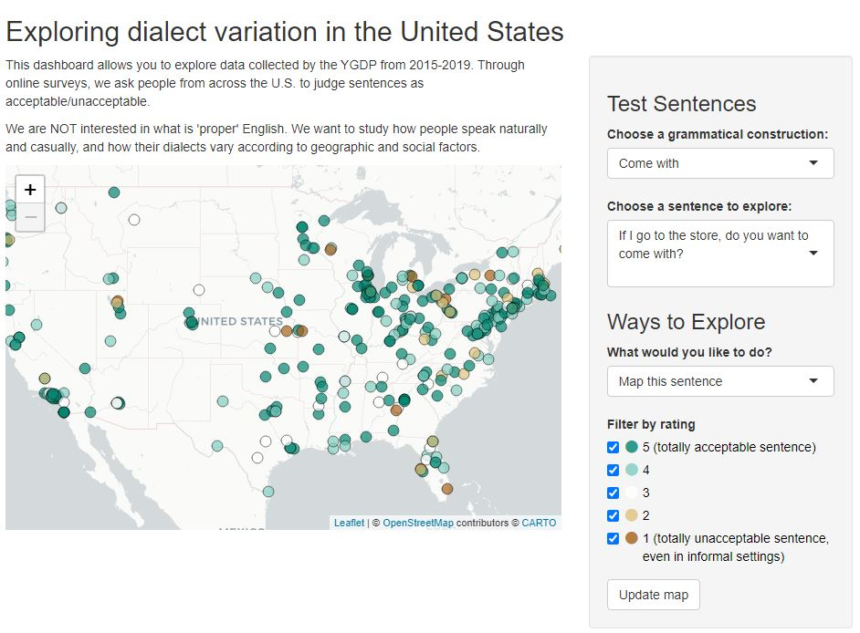
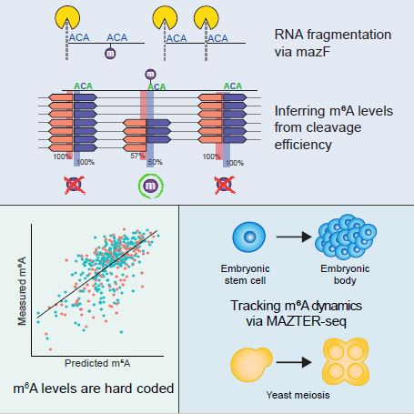
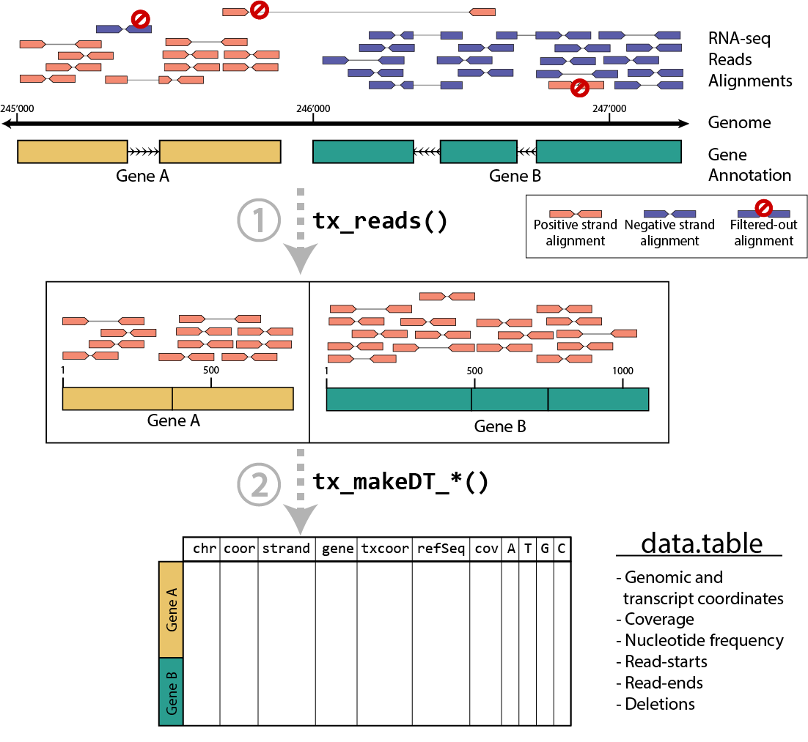
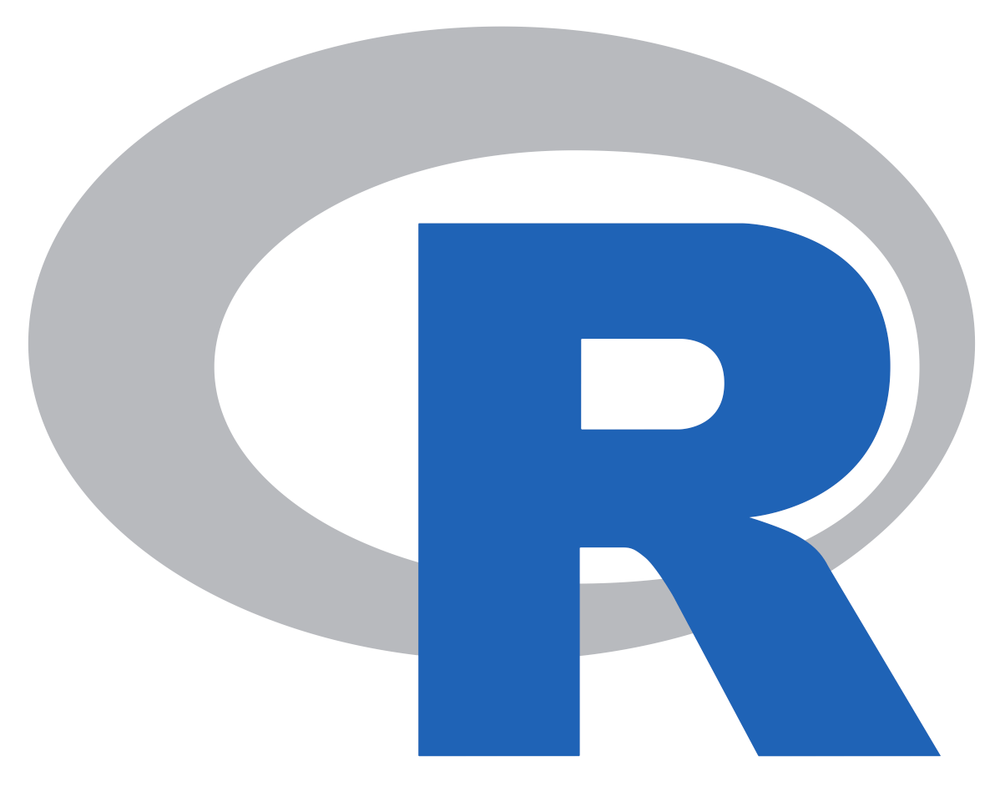
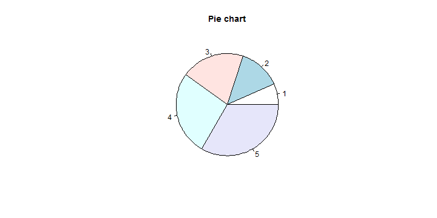

Tutorial #1
========================================================
author: Rstaff_2020
width: 1980
height: 1020
date: 29/10/2020
autosize: T

Course information
========================================================
Here you can find the course information with all relevant links to 
resources [here](https://drive.google.com/open?id=1KhZjZWa2l4oPMHDnkGdojaTN2Oph8l2i&authuser=angel.campos%40ciencias.unam.mx&usp=drive_fs).

|**Lecturers** | |
|:--|:--:|
|[Emmanuel Levy](https://www.weizmann.ac.il/sb/faculty_pages/ELevy/people.html) ||
|[Schraga Schwartz](https://www.weizmann.ac.il/molgen/Schwartz/) ||
|[Igor Ulitzky](https://www.weizmann.ac.il/Biological_Regulation/IgorUlitsky/home) || 

---
|**Teaching Assistants** | |
|:--|:--:|
|[Miguel García](https://angelcampos.github.io/)||
|[Yaara Finkel](mailto:yaara.finkel@weizmann.ac.il)||
|[Hugo Schweke](mailto:hugo.schweke@weizmann.ac.il)||


Course information
==================
## Schedule
- **Lectures**: Mondays, 14:15 - 16:00, [ZOOM link](https://weizmann.zoom.us/j/97084792426?pwd=NysybEN0RlFNN3JoVHJzQ1l2cVplQT09)
- **Tutorials**: Thursday, 14:15 - 16:00, [ZOOM link](https://weizmann.zoom.us/j/96192272862?pwd=T2F6QjhOcHJTa3NoVVdRQlNzR2pWUT09)

## Course Material
Lecture presentations, weekly exercises, general assignments, and supplementary material will be
uploaded to the course's [Google-Drive folder](https://bit.ly/Rcourse2021_GDrive).

---


## Final Grade Breakdown

The final grade for the course is a PASS/FAIL grade, but this is based on a numerical grade, you
should score 75 or above to pass the course.

The final grade breaks down in:
- 20 % Weekly assignments (**Mandatory** *, up to two "strikes" chance to pass the course*). If there are 10 Exercises you need to submit at least 8 in total.
- 80 % General assignments **(Completely mandatory)**.

Completing the course grants **3 credit points**.


Weekly Assignments
===================
## Submission 
Weekly assignments will be available in the [Weekly exercises folder](https://bit.ly/Rcourse2021_WA), on the day of the respective tutorial session. 

We will send a Google Form for submission of assignments.

**Make sure to use the same ID and email address every time you submit your solution to the exercises.**

Weekly assignments must be submitted within one week after receiving the email with our
instructions. 

Delay in submission adds a penalty to the grade, as follows:
- Delay over one week: limits the maximum possible grade to B.
- Delay over two weeks: is considered an F grade.

Weekly exercises submission is mandatory, with a limit of up to two "Not Submitted"
(NS) assignments for passing the course.

--- 

## Grading
The weekly exercises will be graded on a qualitative basis:
- A = 100 (Perfect to almost perfect, 100% to 81% completion)
- B = 80 (Imperfect, 80% to 60% completion)
- F = 0 (Failed, less than 60% completion))
- NS = 0 (Not submitted) 

No personal feedback, other than the one asked and given during tutorials, and
slack WorkSpace. 

All exercises will be considered for calculating their 20% contribution to 
the final grade (including NS).


===================
# General Assignments

## Submission 
* Two general assignments will be released in the middle of the semester and at 
the end of the course. 
* Guidelines of submission are similar to those of weekly exercises
(same ID/email). 
* Commonly 4-week hard-deadline.

## Grading
* These assignments will be graded on a 0 to 100 score basis. 

---

## Code of Ethics
All students taking the course are bound by the [FGS code of ethics](https://www.weizmann.ac.il/feinberg/about/about-fgs/code-ethics).


What is R and why learning R?
==============================
* R is a **programming language**, and as such is at heart a way to give instructions to computers. 
* In general R is mostly used as an statistical and data analysis environment,
a **virtual bench to work with data**. 
* R is also **free software** (GNU General Public License), this means that anyone
can use it to create programs, even for commercial purposes, without the need 
to pay a license.
* R is **widely used** in quantitative and data intensive research fields as well
as by corporate giants such as Google and Microsoft.

---

* In April, 2016. Microsoft [aquired Revolution Analytics](https://blogs.microsoft.com/blog/2015/01/23/microsoft-acquire-revolution-analytics-help-customers-find-big-data-value-advanced-statistical-analysis/)
the leading commercial provider of software and services for R, crucial for the creation of their new product [Machine Learning Server](https://www.microsoft.com/en-us/sql-server/machine-learning-server)

> "R is the world's most popular programming language for statistical computing and predictive analytics, used by more than 2 million people worldwide," - Joseph Sirosh, Corporate Vice President of Information Management & Machine Learning at Microsoft.

What is R and why learning R? II
=================================

* R has become a quite popular language. At the time of writing, R ranks as 
the 7th most popular language in the world and 4th in the US, according to 
the [PYPL index](https://pypl.github.io/PYPL.html).

* R enables a more reproducible and communicable science, through **R Notebooks**.

---

* The **[Bioconductor Project](https://bioconductor.org/)**. Provides a platform 
for R developers to spread **Bioinformatic R packages**. Enabling a more
straight-forward biologically-oriented data analysis.


Exciting examples of R in action by students!
=================

||  | 
|:--|--:|
|Rodrigo Pachecho|PhD student, Urban Ecology, UNAM|
|3D render Lakes of Mexico in aztec times| Raining season basin filling|
| | |

---

| |
|---|
| Ancient Tenochtitlan reimagined| 
|  | 
|[Map of the metro system superimposed on the ancient lake of Texcoco](https://decolonialatlas.wordpress.com/2018/05/12/mexico-citys-buried-history/)| 
| |


Exciting examples of R in action by students!
=================

|| | 
|:--|--:|
|Kaija Gahm |BSc Ecology and Evolution, Yale|
|Yale Grammatical Diversity Project| [Shiny App](https://github.com/kaijagahm/ygdpDashboard)| | 

---



Exciting examples of R in action by students!
=================

||| 
|:--|--:|
|Miguel García |PhD student, Life Sciences, WIS|
|[MAZTER-mine: m6A single nucleotide detection](https://github.com/SchwartzLab/mazter_mine)| |
|| |

---

| |
|---|
|[txtools](https://github.com/AngelCampos/txtools)|
|An R package that processes GenomicAlignments into their transcriptomic versions. |
||


R language
===================
## A bit of history
- R was created by Ross Ihaka and Robert Gentleman at the University of 
Auckland, New Zealand.
- The project was conceived in 1992, with an initial version released in 1995 
and a stable beta version in 2000.
- More than 2 million users by 2014.
- The latest version (4.0.3) was released in 10-October-2020.

## Rstudio
- RStudio is an integrated development environment (IDE) for R.
- Initial release 28 February 2011
- Rstudio makes our lives easier putting in one place many tools to write
R code and beyond!

**Let's go on a tour to check this IDE!**

---
 

Rstudio IDE basics
==============
1. Panes 
  * Text Editor
  * Console 
  * Environment, History
  * Files, Plots, Help
2. Global options 
3. New File 
  * Rscript

---


Objects and functions
========================================================

Everything in R is an **object**, and everything that *happens* is a **function call**.

### What is an object?
An object can be a variable, a data structure, a function, 
or a method, and as such, is a value in memory referenced by an **identifier**. 
[Ref.](https://en.wikipedia.org/wiki/Object_(computer_science))

We assign values to variable names with the `=` and `<-` operators.


```r
x = c(1,2,3,4,5,6)
x
```

```
[1] 1 2 3 4 5 6
```

```r
y <- "Ready or not, here I come!"
y
```

```
[1] "Ready or not, here I come!"
```

--- 

### What is a function?
Is a sequence of program instructions that performs a specific task, packaged as a unit. This unit can then be used in 
programs wherever that particular task should be performed. [Ref.](https://en.wikipedia.org/wiki/Subroutine)


```r
mean(x)
```

```
[1] 3.5
```

```r
mean
```

```
function (x, ...) 
UseMethod("mean")
<bytecode: 0x0000000007e70818>
<environment: namespace:base>
```

Operators in R
==================
An operator is a symbol that tells the R compiler to perform a specific 
manipulation with the objects. R is rich in operators.
[More on operators...](https://www.tutorialspoint.com/r/r_operators.htm)

## Arithmetic Operators

R supports several arithmethic operators

- **+**	addition
- **-** subtraction
- **" * "**	multiplication
- **/**	division
- **^**	exponentiation

--- 


```r
2 + 2
```

```
[1] 4
```

```r
4 - 5
```

```
[1] -1
```

```r
10 * 2
```

```
[1] 20
```

```r
14 / 5
```

```
[1] 2.8
```

```r
2 ^ 17
```

```
[1] 131072
```

Data structures: Vectors
===============
* Data structures are objects used to store data and perform functions with.
* The most basic data structures in R are the **vectors**. 
* Vectors are data ordered in a one-dimensional sequence, as a line or a string.

Vectors can only store one type of data: 

- Numeric
- Logical
- Character
- Factor

* We can manually create vectors using the combine function: **`c()`**.
* To create factors we use the factors function: **`factor()`**.

---

```r
c(2, 4, 6)
```

```
[1] 2 4 6
```

```r
c(T, F, T, TRUE, FALSE)
```

```
[1]  TRUE FALSE  TRUE  TRUE FALSE
```

```r
c("sick", "healthy", "healthy", "healthy", "sick")
```

```
[1] "sick"    "healthy" "healthy" "healthy" "sick"   
```

```r
factor(c("sick", "healthy", "healthy", "healthy", "sick"))
```

```
[1] sick    healthy healthy healthy sick   
Levels: healthy sick
```

Creating and manipulating vectors
=========================
The `[]` operator is used to extract elements of vectors

```r
x <- 1:20
# The fourth element.
x[4] 
```

```
[1] 4
```

```r
# All but the fourth.
x[-4] 
```

```
 [1]  1  2  3  5  6  7  8  9 10 11 12 13 14 15 16 17 18 19 20
```

---


```r
# Elements two to four.
x[2:4] 
```

```
[1] 2 3 4
```

```r
# All elements except two to four.
x[-(2:4)] 
```

```
 [1]  1  5  6  7  8  9 10 11 12 13 14 15 16 17 18 19 20
```

```r
# Elements one and five.
x[c(1, 5)] 
```

```
[1] 1 5
```

Named Vectors
============
We can also set names for elements in vectors and subset them by these names


```r
y <- 1:3
# Setting names
names(y) <- c("first", "second", "third")
y
```

```
 first second  third 
     1      2      3 
```

```r
# Only print names
names(y)
```

```
[1] "first"  "second" "third" 
```

```r
# Extract by name
y["second"]
```

```
second 
     2 
```

Vectorized operations
=============================

* Many operations in R are vectorized, meaning that operations occur in parallel
 in certain R objects. 
* This allows you to write code that is efficient, concise, and easier to read
 than in non-vectorized languages.[1](https://bookdown.org/rdpeng/rprogdatascience/vectorized-operations.html)

Apply operation in each pair of elements (and recycle elements if needed)

```r
c(1,2) * c(1,2,3,4)
```

```
[1] 1 4 3 8
```

When done to one element this is not apparent

```r
2 * c(1,2,3,4)
```

```
[1] 2 4 6 8
```

Generic functions
==================
Many R functions are generic and can have different behaviours depending on the 
class of  object that you input them.

For example the summary() function

```r
summary(1:10)
```

```
   Min. 1st Qu.  Median    Mean 3rd Qu.    Max. 
   1.00    3.25    5.50    5.50    7.75   10.00 
```

```r
summary(c(T,F,T,T,F,F,F))
```

```
   Mode   FALSE    TRUE 
logical       4       3 
```

---


```r
summary(c("sun", "moon", "stars"))
```

```
   Length     Class      Mode 
        3 character character 
```

```r
summary(factor(c("sick", "healthy", "healthy", "healthy", "sick")))
```

```
healthy    sick 
      3       2 
```

Basic plots
=====


```r
data <- rnorm(100)
plot(data, main = "Scatterplot")
```


```r
hist(data, main = "Histogram")
```


---


```r
boxplot(data, main = "Boxplot")
```


```r
pie(1:5, main = "Pie chart")
```



Some references to start your R journey
========================================================
* [base-R Cheatsheet](http://github.com/rstudio/cheatsheets/raw/master/base-r.pdf)
You can find more cheat sheets in [here](https://rstudio.com/resources/cheatsheets/)

* [R-style Guide](https://style.tidyverse.org/) by Hadley Whickham " aka The R Messiah". Is a great reference to get good R coding habits from the beginning.


