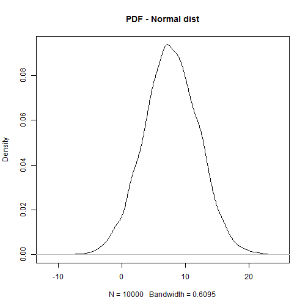
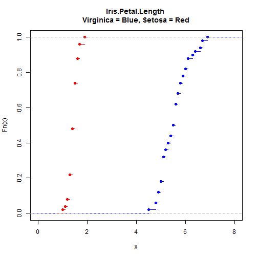

Tutorial # 10
========================================================
author: Rstaff_2021
width: 1920
height: 1080
date: "2021-01-07"
autosize: T

Weekly Exercise #7 Solution
========================

[Exercises solutions folder](https://drive.google.com/open?id=1Aw9wkxRef9vM4nptgFTb4eZdowHBd1p7)

Outline
========

- Probability density function
- Empirical Cumulative Distribution Function
- Distributions
    + Uniform
    + Normal Distribtuion
    + Poisson
    + Binomial
- Statistical Tests
    + t tests
    
---

- Multiple Hypothesis Testing
    + MHT correction methods
        - Bonferroni
        - Hochberg
        - FDR

Probability Density Function (PDF)
=====================
The PDF is used to specify the probability of the random variable falling within 
a particular range of values, as opposed to taking on any one value.

In R we calculate the PDF using `density()`


```r
samp1 <- rnorm(n = 10000, mean = 7.78, sd = 4.35)
plot(density(samp1), main = "PDF - Normal dist")
```



---

It's histogram would look similar


```r
hist(samp1, main = "Histogram - Normal dist")
```


Now some real data
===================

USArrests = Violent Crime Rates by US State in 1973


```r
hist(USArrests$Murder, main = "Murder rate USA - 1973")
```


---


```r
plot(density(USArrests$Murder), main = "Murder rate USA - 1973") 
```


Empirical Cumulative Distribution Function (ECDF)
==========================================


```r
smp_A <- rnorm(n = 1000, mean = 100, sd = 10)
smp_B <- rnorm(n = 1000, mean = 110, sd = 10)

plot(ecdf(smp_A), col = "blue", main =  "ECDF") 
lines(ecdf(smp_B), col = "red")
```


--- 

With some real data. Using Iris 


```r
plot(ecdf(iris$Petal.Length[iris$Species == "virginica"]),
     col = "blue", xlim = c(0,8), main = "Iris.Petal.Length \nVirginica = Blue, Setosa = Red") 
lines(ecdf(iris$Petal.Length[iris$Species == "setosa"]), col = "red") 
```



Distributions
==============

+ Uniform
+ Poisson
+ Binomial

Uniform
========

Uniform. The probability of falling in an interval of fixed length is 
constant.


```r
unif_1 <- runif(10000, min = 100, max = 110)
hist(unif_1, maim = "Histogram - Uniform dist.")
```


---

```r
plot(density(unif_1),  main = "PDF - Uniform distribution")
```


Uniform
========

ECDF

```r
plot(ecdf(unif_1), main = "ECDF - Uniform distribution")
```


Binomial
========

Is the discrete probability distribution of the number of successes in a 
sequence of n independent experiments, each asking a yes–no question.

Example: Landing heads with a fair coin in 10 throws. 


```r
binom1 <- rbinom(1000, size = 10, prob = 0.5)
plot(density(binom1), "PDF - Binomial distribution")
```


---

Changing the bandwidth optimization algorithm. As the default is not recommended,
was left for historical comparison reasons.


```r
plot(density(binom1, bw = "SJ"), "PDF - Binomial distribution")
```


Binomial 
========


```r
hist(binom1, breaks = 100, main = "Histogram with many breaks")
```


---


```r
plot(ecdf(binom1), main = "ECDF - Binomial d")
```


Poisson
=======

Is a discrete probability distribution that expresses the probability of a 
given number of events occurring in a fixed interval of time or space if these 
events occur with a **known constant mean rate** and independently of the time
since the last event.

Examples: 

- The number of meteorites greater than 1 meter diameter that strike Earth in a year


```r
pois1 <- rpois(n = 1000, lambda = 10) 
hist(pois1, breaks = 100, main = "Histogram of Poisson Distribution")
```


---


```r
plot(density(pois1, bw = "SJ"), main = "PDF - Poisson Distribution")
```


Poisson
=======


```r
plot(ecdf(pois1), main = "ECDF- Poisson Distribution")
```


Statistical tests
========

+ t tests
+ Wilcoxon test
+ Possion
+ Binomial


Student's t-test
================

The t-test can be used to determine if the means of two sets of data are 
significantly different from each other. Assumming that the data distributes
normally.


```r
# We can test for normality of variablaes using the Shapiro test.
shapiro.test(USArrests$Murder)
```

```

	Shapiro-Wilk normality test

data:  USArrests$Murder
W = 0.95703, p-value = 0.06674
```

---


```r
library(car)
qqp(USArrests$Murder)
```


```
[1] 10 24
```

Student's t-test
================

Lets split the US states by urban population in two groups

```r
USArrests$groups <- cut(USArrests$UrbanPop, breaks = 2)
pairs(USArrests)
```


---


```r
boxplot(USArrests$UrbanPop ~ USArrests$groups, ylab = "Urban Population")
```


Student's t-test
================

Testing if the rate of murder is different by the population split


```r
t.test(USArrests$Murder~USArrests$groups)
```

```

	Welch Two Sample t-test

data:  USArrests$Murder by USArrests$groups
t = 0.12856, df = 28.162, p-value = 0.8986
alternative hypothesis: true difference in means is not equal to 0
95 percent confidence interval:
 -2.696984  3.058274
sample estimates:
mean in group (31.9,61.5] mean in group (61.5,91.1] 
                 7.900000                  7.719355 
```

---


```r
boxplot(USArrests$Murder ~ USArrests$groups, ylab = "Murder Rate")
```


Student's t-test
================

What about the effect of urban population and rape?


```r
t.test(USArrests$Rape~USArrests$groups)
```

```

	Welch Two Sample t-test

data:  USArrests$Rape by USArrests$groups
t = -2.5795, df = 38.941, p-value = 0.01379
alternative hypothesis: true difference in means is not equal to 0
95 percent confidence interval:
 -11.830155  -1.430965
sample estimates:
mean in group (31.9,61.5] mean in group (61.5,91.1] 
                 17.12105                  23.75161 
```

----


```r
boxplot(USArrests$Rape ~ USArrests$groups, ylab = "Murder Rate")
```


Other statistical tests
=========================

Other statistical test Rbase containg are 

- binom.test(). Binomial test
- poisson.test(). Poisson test
- wilcox.test(). Wilcox test


Multiple Hypothesis Testing Correction
======================================

Statistical hypothesis testing is based on rejecting the null hypothesis if 
the likelihood of the observed data under the null hypotheses is low. If 
multiple hypotheses are tested, the chance of observing a rare event increases, 
and therefore, the likelihood of incorrectly rejecting a null hypothesis 
(i.e., making a Type I error) increases.

The Bonferroni correction compensates for that increase by testing each 
individual hypothesis at a significance level of alpha/(Number of hypothesis)


```r
pVals <- data.frame(raw = unlist(lapply(1:10000, function(x){
    smp1 <- rnorm(10, 100, 1)
    smp2 <- rnorm(10, 100, 1)
    t.test(smp1, smp2)$p.value
})))
pVals$bonferroni <- p.adjust(pVals$raw, method = "bonferroni")
pVals$fdr <- p.adjust(pVals$raw, method = "fdr")
pVals$hochberg <- p.adjust(pVals$raw, method = "hochberg")
```

--- 


```r
boxplot(-log10(pVals), main = "pValues, raw and after correcting")
abline(h = -log10(0.05), col = "blue")
```


Another example
===============


```r
pVals <- data.frame(raw = unlist(lapply(1:10000, function(x){
    smp1 <- rnorm(3, 100, 1)
    smp2 <- rnorm(3, 105, 1)
    t.test(smp1, smp2)$p.value
})))
pVals$bonferroni <- p.adjust(pVals$raw, method = "bonferroni")
pVals$fdr <- p.adjust(pVals$raw, method = "fdr")
pVals$hochberg <- p.adjust(pVals$raw, method = "hochberg")
```

---


```r
boxplot(-log10(pVals), main = "pValues, raw and after correcting")
abline(h = -log10(0.05), col = "blue")
```


