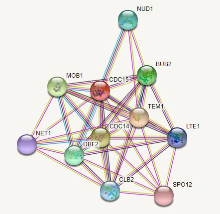
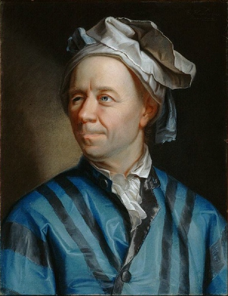
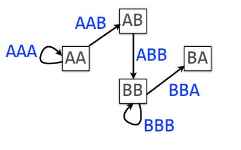
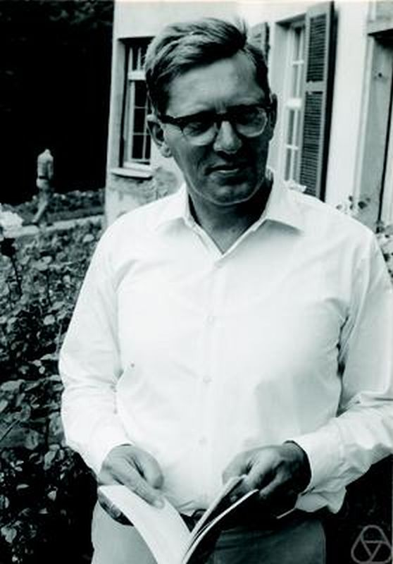
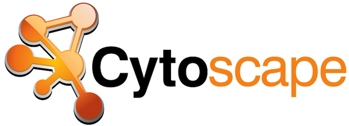

Tutorial # 13
========================================================
author: Rstaff_2020
width: 1920
height: 1080
date: 28/January/2021
autosize: T

<style>
.xs-code pre code {font-size: 0.8em;}
.s-code pre code {font-size: 1em;}
.m-code pre code {font-size: 1.2em;}
.l-code pre code {font-size: 1.5em;}
</style>

Weekly Exercise Solution
========================


Install Packages
=================

For this tutorial we will use the packages `igraph` from CRAN, and 
`org.Hs.eg.db` from Bioconductor. Uncomment and use the code bellow to install
the packages if required


```r
# install.packages("igraph")
# BiocManager::install("org.Hs.eg.db")
```

---

`suppressPackageStartupMessages()` as it names implies omits the printing of
the messages that appear in console when we load a package with `library()`


```r
suppressPackageStartupMessages(library(org.Hs.eg.db))
suppressPackageStartupMessages(library(igraph))
```

Intro 
=======

## Graphs aka Networks

A [**graph**](https://en.wikipedia.org/wiki/Graph_(discrete_mathematics) 
is a mathematical structure used to model pairwise relations
between a set of objects which are in some sense "related". 

A graph is composed by **vertices** (aka *nodes*) and **edges** (aka *links*).

* **Vertices** are the objects that are related or conected in a graph.
* **Edges** are the relationships shared between **pairs** of vertices.
* **Connected component**, or simply "component", is a group of vertices that 
share at least one link between them, but not with the rest of vertices in the graph.
* **Cluster**, loosely, is a group of nodes that share a similar place or 
characteristics in the graph, that distinguish them from other groups of vertices.

---

An example of the use of networks in Life Sciences Research is 
[STRING](https://string-db.org/).

STRING (Search Tool for the Retrieval of Interacting Genes/Proteins) is a 
biological database and web resource of known and predicted protein-protein
interactions.



**[STRING-DB Protein interactions database](https://string-db.org/cgi/network?taskId=bEb3mhIlOVcn)**

[CDC15 Network, Sacharomyces cerevisiae](https://string-db.org/cgi/network.pl?taskId=epi6be0RsNEm)


================

## Why graphs?

Graphs allow us to conceptualize and represent problems that will otherwise 
be difficult to do, and to understand.

The graphs concept also allow us to understand complex systems and 
the relationships between their elements that would otherwise be difficult to 
represent.

> Consider for example the work that is involved to understand the association 
between two different proteins (e.g. reaction catalysis, physical interaction,
complex formation). If we connect all known associations we would have a network
of how all proteins in organisms are related to one another. Then connections
between apparently unrelated proteins would become evident.

---

## Seven Bridges of Konigsberg

A classic problem that marked the beginning of the research field now known as 
graph theory is the [Seven Bridges of Konigsberg](https://en.wikipedia.org/wiki/Seven_Bridges_of_K%C3%B6nigsberg).

The city of Konigsberg in Prussia (now Kaliningrad, Russia) was set on both 
sides of the Pregel River, and included two large islands -Kneiphof and 
Lomse- which were connected to each other, or to the two mainland portions of 
the city, by seven bridges. The problem was to devise a walk through the city 
that would cross each of those bridges once and only once.


================

## Eulerian paths

Leonhard Euler (1707 - 1783) was a Swiss polymath who in 1736
proved that the problem has no solution. The difficulty he faced was the 
development of a suitable technique of analysis, and tests that established this
assertion with mathematical rigor.

By way of abstracting the Seven Bridges of Konigsberg problem into an
abstract representation, Euler was able to notice that:

* The only important feature of the problem is the **sequence of bridges crossed**,
and the bridges themselves (how people travel between bridges is irrelevant).
* The only way to transverse a land mass (vertex) is **entering** through a 
bridge (edge) and exiting by another, only except at the start and ending points.
* The only way a network can be traversed completely, using each vertex
once, is by **having even number of edges in all the vertices**, only allowing 
exceptions for the starting and ending vertices, this is now known as an **Eulerian path**.

---





================

## de Bruijn Graphs and genome assembly

In genome assembly, genomes are composed of very long sequences which cannot
be retrieved as a whole, we have to put together the pieces that we get by
sequencing.

De bruijin graphs (DBG) are graphs in which nodes are words or sequences, and 
links exist between them only if they where found in the same sequence.

In this manner DBG and Eulerian paths offer a very elegant solution to assemble
genomes. As **Eulerian paths are the most parsimonious way of connecting all**
**the sequences together** once you have constructed the network.



The above DBG would be generated by partioning the sequence **AAABBBA**.

---


Nicolaas Govert de Bruijn (9 July 1918 - 17 February 2012) Dutch mathematician.

De Bruijn Graph assembly by Ben Langmead [Slides](https://www.cs.jhu.edu/~langmea/resources/lecture_notes/assembly_dbg.pdf)


Real world data EXERCISE
===================

## Domain co-ocurrence network

### Processing data


```r
hs.prot = read.csv("human_reference_proteome.csv", stringsAsFactors=FALSE)
RES = AnnotationDbi::select(org.Hs.eg.db,
                            columns=c("PFAM"),
                            keytype = c("UNIPROT"),
                            keys = hs.prot$id)
## Filtering undefined domains and keeping unique pairs
RES = RES[which(RES$PFAM !=""),]
RES = unique(RES) 
RES.sp = split(RES$PFAM, RES$UNIPROT)
RES.list = lapply(RES.sp, function(x){ 
    if(length(x) > 1){
        # Creates all pairs of combinations between elements in x
        return(combn(x, 2, )) 
    }else{
        # Orphan elements in x, "binds" it with alone
        return(rbind(x[1], "alone") 
        )
    }
})
```

---


```r
RES.mat = matrix(unlist(RES.list), ncol = 2, byrow = TRUE)
# Let us eliminate all edges with the "alone" node.
RES.mat <- RES.mat[RES.mat[, 2] != "alone",]
# Sorting rows allow us to detect duplicates,
dat.sort = t(apply(RES.mat, 1, sort))      
# and eliminate them as the network will be undirected.
RES.mat <- RES.mat[!duplicated(dat.sort),] 
# Create an igraph object using a two-column matrix (edge list)
pfamNet = graph_from_edgelist(RES.mat, directed = FALSE)
```

## Export to Cytoscape


```r
# Write in tab-separated table to export to cytoscape 
write.table(RES.mat, file = "pfamNet.tsv", sep = "\t", quote = F, row.names = F, col.names = F)
```

## Let's have a brief tour through some of the main functions of **igraph**!

And go through the last weekly exercise.

Cytoscape basic graph analysis and manipulation
===============================================

* Select nodes
* Select neighboring nodes
* Moving nodes
* Creating subgraphs
* Network analyzer
* Visualize parameters
* Changing visualization parameters
* Layouts

---



The end
=======
# FIN
