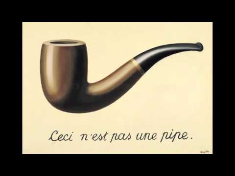
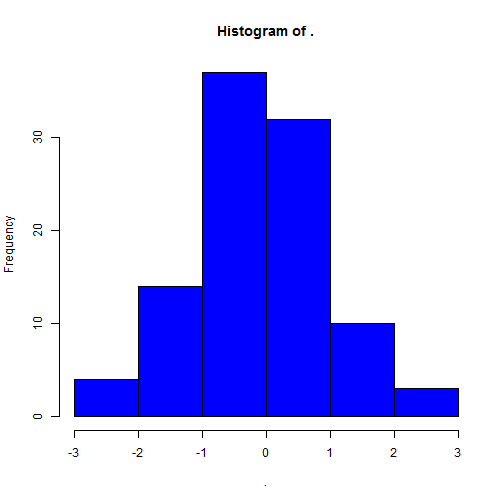
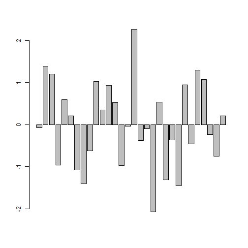
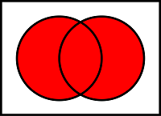
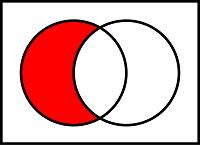

Tutorial # 7
========================================================
author: Rstaff_2021
width: 1920
height: 1080
date: "2020-12-10"
autosize: T

Weekly Exercise #5 Solution
========================

[Exercises solutions folder](https://drive.google.com/open?id=1Aw9wkxRef9vM4nptgFTb4eZdowHBd1p7&authuser=angel.campos%40ciencias.unam.mx&usp=drive_fs)


Pipe, magrittr package
=========

## The pipe operator %>% 

The Idea behind the pipe operator is to make code more readable and programming 
more structured in a linear way, as processes happen in a factory in a conveyor
belt. One after the other.

The magrittr package offers a set of operators which make your code more 
readable by:

* Structuring sequences of data operations left-to-right (as opposed to from the inside and out), avoiding nested function calls.
* Minimizing the need for local variables and function definitions.
* Making it easy to add steps anywhere in the sequence of operations.

---



Usage
=====

We use a pipe `%>%` for passing the result of a lefft-side 
expression to a right-side function.

### Basic piping

* x %>% f(y) is equivalent to f(x, y)


```r
library(magrittr)
rnorm(100) %>% hist(col = "blue")
```



---

### A bit more ambitious

* x %>% f %>% g %>% h is equivalent to h(g(f(x)))


```r
rnorm(100) %>% sample(30) %>% barplot()
```



More information on the `%>%` operator in this [webpage](https://magrittr.tidyverse.org/)

Sets
=====

In mathematics, a set is a well-defined collection of **distinct** objects, 
considered as an object in its own right. The **arrangement** of the 
objects in the set does not matter. [Link to Wikipedia article](https://en.wikipedia.org/wiki/Set_(mathematics))

In R we can make **set operations** using the functions:

| | | | |
|---|---|---|---|
|- union() |  | - intersect() |  |
|- setdiff() |  |- setequal() | |

Each of this functions will discard any duplicated values in the arguments, 
and they apply *as.vector* to their arguments (and so in particular coerce 
factors to character vectors).


```r
set.seed(2021)
set1 <- sample(letters, 10)
set2 <- sample(letters, 10)
```

---


```r
set1
```

```
 [1] "g" "f" "n" "z" "l" "t" "y" "u" "s" "x"
```

```r
set2
```

```
 [1] "e" "o" "g" "i" "l" "s" "r" "c" "n" "h"
```

**Union**


```r
union(set1, set2)
```

```
 [1] "g" "f" "n" "z" "l" "t" "y" "u" "s" "x" "e" "o" "i" "r" "c" "h"
```

**Intersection**

```r
intersect(set1, set2)
```

```
[1] "g" "n" "l" "s"
```

Sets
======

For either of `union()` or `intersection()` the order of arguments is not 
relevant. But that is not the case for `setdiff()`

**Set difference** 


```r
# set1 removing the shared elements in set2
setdiff(set1, set2)
```

```
[1] "f" "z" "t" "y" "u" "x"
```

```r
# set2 removing the shared elements in set1
setdiff(set2, set1)
```

```
[1] "e" "o" "i" "r" "c" "h"
```

Order matters using `setdiff()``!

---

**Set equality**


```r
# set1 and set2 are NOT equal
setequal(set1, set2)
```

```
[1] FALSE
```

```r
# Scrambling set1
setequal(set1, sample(set1))
```

```
[1] TRUE
```

Checking for equality of elements may be useful in quality control to make sure
that different datasets have the same elements. For example when you are 
expecting to have the same genes in two data sets.


PCA - Theory
=============

- The **principal components** of a collection of points in a real *p-space* are a 
sequence of *p* direction vectors, where the *ith* vector is the direction of a
line that best fits the data while being orthogonal to the first *i-1* vectors.

- Here, a best-fitting line is defined as one that minimizes the average squared
distance from the points to the line. 


---

-Principal component analysis (PCA) is the process of computing the principal 
components and using them to perform a change of basis on the data.

- PCA is used in exploratory data analysis and for making predictive models. 

- It is commonly used for dimensionality reduction by projecting each data point
onto only the first few principal components to obtain lower-dimensional data 
while preserving as much of the data's variation as possible. 
[Wiki](https://en.wikipedia.org/wiki/Principal_component_analysis)

PCA - Building intuition
======  

Let's start with two dimensions of the iris dataset.


```r
library(ggplot2)
iris2D <- data.frame(petL = iris[,3],
                     petW = iris[,4])
ggI <- ggplot(iris2D, aes(petL, petW, colour = iris$Species)) +
    geom_point() + ggtitle("Original Measures") + theme_bw()
plot(ggI)
```


---

Now let's perform a PCA using default parameters.


```r
PCA_1 <- prcomp(iris2D) %>% .$x %>% data.frame
gg_1 <- ggplot(PCA_1, aes(PC1, PC2, colour = iris$Species)) +
    geom_point() + ggtitle("Default PCA") + theme_bw()
plot(gg_1)
```


arguments in prcomp()
================================

`prcomp()` has two main arguments that will change the PCA algorithm:

- **scale**: a logical value indicating whether the variables should be scaled
to have unit variance before the analysis takes place. By default is set 
to **FALSE** but is advisable to change to **TRUE**.
- **center**: a logical value indicating whether the variables should be 
shifted to be zero centered. By default **TRUE**, advisable left as is.


```r
PCA_2 <- prcomp(iris2D, scale = T) %>% .$x %>% data.frame
gg_2 <- ggplot(PCA_2, aes(PC1, PC2, colour = iris$Species)) +
    geom_point() + ggtitle("PCA. scale = TRUE") + theme_bw()
```


```r
PCA_3 <- prcomp(iris2D, center = F) %>% .$x %>% data.frame
gg_3 <- ggplot(PCA_3, aes(PC1, PC2, colour = iris$Species)) +
    geom_point() + ggtitle("PCA. center = FALSE") + theme_bw()
```

---

Against each other
===============


```r
gridExtra::grid.arrange(ggI, gg_1, gg_2, gg_3, ncol = 2)
```


Another way to show
============


```r
# Scaling with scale()
iris2D %>% scale() %>% prcomp(scale = F) %>% .$x %>% plot(col = iris$Species)
```


```r
# Scaling with argument scale
iris2D %>% prcomp(scale = T) %>% .$x %>% plot(col = iris$Species)
```


---


```r
# Not scaling
iris2D %>% prcomp(scale = F) %>% .$x %>% plot(col = iris$Species)
```


Exercise
=========

* Perform a PCA of the `mtcars` dataset
* Plot the 2 first PCs
* Determine the most correlated variable from the original data set to the 1st
Principal Component.


```r
pairs(mtcars[,1:4], col = mtcars$cyl, main = "Motor Trend Car Road Tests", pch = 16)
```


Solution
=========


```r
mtcars_pca <- prcomp(mtcars)
plot(mtcars_pca$x, main = "MTCARS data set PCA")
text(mtcars_pca$x, rownames(mtcars), col = "blue", pos = 3)
```


---


```r
cor(mtcars, mtcars_pca$x[,1]) %>% which.max %>% colnames(mtcars)[.]
```

```
[1] "disp"
```

```r
plot(mtcars$disp, mtcars_pca$x[,1], main = "Most correlated variable", xlab = "DISP", ylab = "PC1", pch = 16)
```


Engine displacement is the measure of the cylinder volume swept by all of the 
pistons of a piston engine.

R notebook 
============
## Making an R notebook with R studio

Let's go to a live tutorial in the Rstudio IDE, anything can happen!

1. Let's create a Rmd file with the FILE menu in Rstudio
2. Let's so through some changes to the template
3. Check some Rmarkdown
4. Render a notebook in html

Weekly Exercise
===============

You are given two files "UK_weekFood_1.txt" and "UK_weekFood_2.txt"


```r
file1 <- read.delim("UK_weekFood_1.txt", row.names = 1)
head(file1)
```

```
                                                   Units South.East South.West
Milk and milk products excluding cheese               ml       1768       1967
Flour                                                  g         57         61
Cakes, buns and pastries                               g        157        172
Biscuits and crispbreads                               g        164        177
Fresh and processed potatoes                           g        652        664
Fresh and processed vegetables, excluding potatoes     g       1217       1274
                                                   England Wales Scotland
Milk and milk products excluding cheese               1805  1883     1678
Flour                                                   70    36       32
Cakes, buns and pastries                               155   143      140
Biscuits and crispbreads                               164   171      163
Fresh and processed potatoes                           649   687      615
Fresh and processed vegetables, excluding potatoes    1156  1077      957
                                                   Northern.Ireland
Milk and milk products excluding cheese                        2003
Flour                                                            30
Cakes, buns and pastries                                        192
Biscuits and crispbreads                                        181
Fresh and processed potatoes                                   1063
Fresh and processed vegetables, excluding potatoes              917
```

Let's open the Example Notebook to see how the solutions
should look like.


3D plot 
============

Check the R notebook version of the slides to see some 3D plots on the Iris
dataset and PCA of 3 of its variables.

